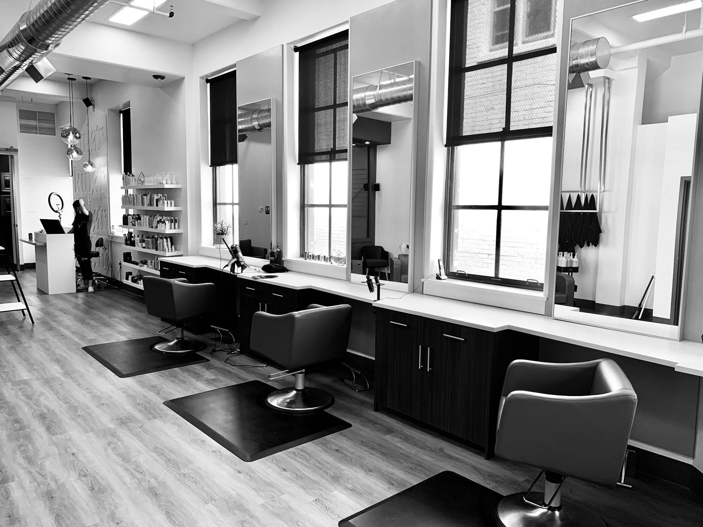

# 💄 Bella Nova — Beauty & Care

**Institut de beauté haut de gamme à Kinshasa (RDC)**

Site vitrine élégant et responsive présentant les services d'un institut de beauté : manucure, pédicure, maquillage, sourcils et soins visage.

🌐 **[Voir le site en ligne](https://bellanova.netlify.app)**

## ✨ Aperçu



---

## 🛠 Services présentés

| Service | Description |
|---------|-------------|
| 💅 **Manucure** | Classique, semi-permanent, gel, nail art |
| 🦶 **Pédicure** | Gommage, massage, mise en beauté |
| 💋 **Maquillage** | Mariage, shooting, soirée, quotidien |
| 👁 **Sourcils** | Restructuration, épilation au fil, teinture |
| 🧖 **Soins Visage** | Nettoyage, hydratation, anti-âge, éclat |

---

## 🚀 Stack technique

- **HTML5** — Structure sémantique
- **CSS3** — Variables, animations personnalisées, responsive
- **Bootstrap 5.3** — Grille, navbar, offcanvas, carrousels
- **JavaScript vanilla** — Animations au scroll, formulaire, carrousels
- **Font Awesome 6** — Icônes
- **Formspree** — Gestion du formulaire de contact

---

## 📁 Structure du projet

```bash
bella-nova/
├── index.html          # Page principale
├── css/
│   └── style.css       # Styles personnalisés
├── js/
│   └── script.js       # Animations et interactions
├── images/
│   ├── logo-principal.png
│   ├── hero-bg.jpeg
│   ├── apropos-bg.jpg
│   ├── services/
│   │   ├── manucre/
│   │   │   ├── manucure 1 (1).jpg
│   │   │   ├── manucure 1 (2).jpg
│   │   │   ├── manucure 1 (3).jpg
│   │   │   ├── manucure 1 (4).jpg
│   │   │   └── manucure 1 (5).jpg
│   │   ├── pedicure/
│   │   │   ├── pedicure 1 (1).jpeg
│   │   │   ├── pedicure 1 (1).jpg
│   │   │   ├── pedicure 1 (3).jpg
│   │   │   ├── pedicure 1 (4).jpg
│   │   │   └── pedicure 1 (5).jpg
│   │   ├── maquillage/
│   │   │   ├── maquillage 1 (1).jpeg
│   │   │   ├── maquillage 1 (1).jpg
│   │   │   ├── maquillage 1 (2).jpeg
│   │   │   └── maquillage 1 (2).jpg
│   │   ├── sourcils/
│   │   │   ├── sourcils 1 (1).jpg
│   │   │   ├── sourcils 1 (2).jpg
│   │   │   └── sourcils 1 (3).jpg
│   │   └── soins-visage/
│   │       ├── soins-visage 1.jpg
│   │       └── soins-visage 2.jpg
│   ├── temoins/
│   │   ├── temoin1.jpg
│   │   ├── temoin2.jpg
│   │   └── temoin3.jpg
│   └── equipe/
│       ├── equipe1.jpg
│       ├── equipe2.jpg
│       └── equipe3.jpg
└── README.md

```
---

## 🎨 Palette de couleurs

| Couleur | Code hex |
|---------|----------|
| Bordeaux | `#A44251` |
| Rose | `#E28087` |
| Rose poudre | `#F6DBDE` |
| Crème | `#F7EFE6` |
| Rose gold | `#C78B7A` |

---

## 📱 Fonctionnalités

- Design responsive (mobile, tablette, desktop)
- Menu offcanvas sur mobile
- Carrousels d'images avec fondu pour chaque service
- Animations au scroll (fade-in, slide-in)
- Formulaire de contact avec feedback visuel
- Liens directs WhatsApp
- Navigation fluide (smooth scroll)
- Témoignages clients
- Section équipe et valeurs

---

## 🚢 Déploiement

Le site est déployé sur **Netlify** avec déploiement continu depuis GitHub.


### Mettre à jour le site

```
git add .
git commit -m "Description des modifications"
git push

```


Le déploiement se fait automatiquement.

---

🔧 Installation locale

1. Cloner le dépôt

```bash
git clone https://github.com/bertillepu05-svg/BellaNova
```

1. Ouvrir le dossier

```bash
cd bella-nova
```

1. Lancer avec un serveur local (optionnel)

```bash
# Avec Python
python -m http.server

# Avec VS Code Live Server
# Clic droit sur index.html → "Open with Live Server"
```

1. Ouvrir dans le navigateur

```
http://localhost:8000
```

---

👩‍🎨 Crédits

Fondatrice : Rosine P.

Design & Développement : Bertille Pumbulu

Contact : contact@bellanova.com

Téléphone : +243 972 431 636

Localisation : Kinshasa, RDC

---

📄 Licence

Projet privé — Tous droits réservés © 2026 Bella Nova Beauty & Care.

```


